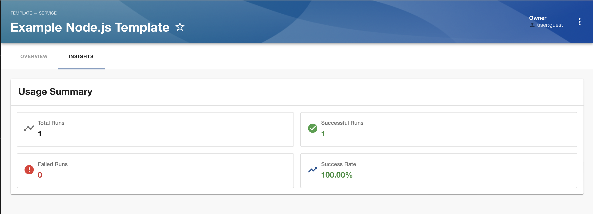

# usage-statistics

Welcome to the `usage-statistics` plugin. This Backstage plugin helps you understand how templates are being used across your organization by surfacing metrics and trends from scaffolder task history.


## Features

The `usage-statistics` plugin provides the following features:

### Per Template Details
- Success/Failure rate for template.



## Setup

The following section will help you get the pusage-statistics plugin setup and running

### Backend

You need to setup the [usage-statistics backend plugin](../usage-statistics-backend/README.md) before you move forward with any of the foloowing steps.

### Frontend 

To setup the usage-statistics frondend plugin you'll need to do the following steps:

1. First we need to add the `@codeverse-gp/plugin-usage-statistics` package to your frontend app:

```sh
# From your Backstage root directory
yarn -cwd packages/app add @codeverse-gp/plugin-usage-statistics
```

2. Now open `packages/app/src/catalog/EntityPage.tsx` file

3. Then after all the import statements add the following line
```ts
import { UsageSummaryCard } from '@codeverse-gp/plugin-usage-statistics';
```

4. Add templatePage section to file.

```ts
const templatePage = (
  <EntityLayout>
    <EntityLayout.Route path="/" title="Overview">
      <Grid container spacing={3} alignItems="stretch">
        {entityWarningContent}
        <Grid item md={6}>
          <EntityAboutCard variant="gridItem" />
        </Grid>
        <Grid item md={6} xs={12}>
          <EntityCatalogGraphCard variant="gridItem" height={400} />
        </Grid>
        <Grid item md={6}>
          <EntityHasSystemsCard variant="gridItem" />
        </Grid>
      </Grid>
    </EntityLayout.Route>
    <EntityLayout.Route path="/usage-statistics" title="Insights">
    <UsageSummaryCard />
    </EntityLayout.Route>
  </EntityLayout>
);

.
.
.
.

<EntitySwitch.Case if={isKind('template')} children={templatePage} />
```

5. Now run `yarn start` from root of your project and you should see the Insights tab in template view.
