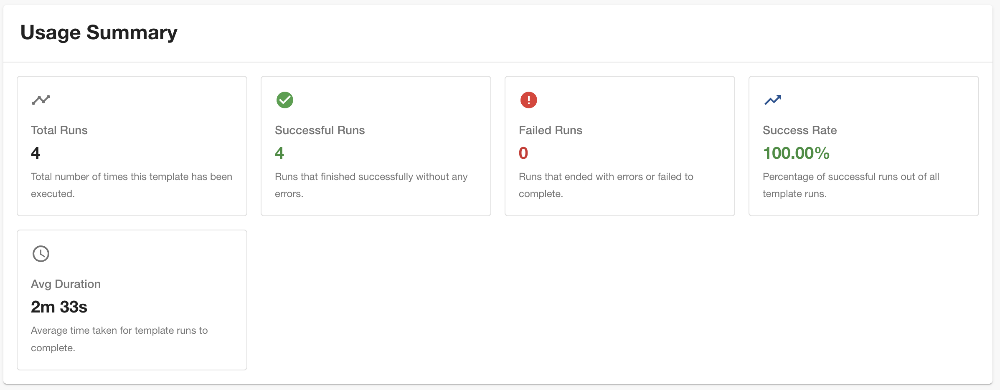

# usage-statistics

Welcome to the `usage-statistics` plugin. This Backstage plugin helps you understand how templates are being used across your organization by surfacing metrics and trends from scaffolder task history, directly within the template entity view.

## Components

### TemplateUsageSummaryCard

Provides a quick overview of template usage statistics in an easy-to-read card format, directly within the template entity view.

**Features:**

- Total template runs count
- Successful runs with success rate percentage
- Failed runs count
- Color-coded indicators for quick assessment
- Average duration for completed tasks



### TemplateMonthlyStatsCard

Displays monthly usage statistics through interactive bar charts, directly within the template entity view.

**Features:**

- Monthly breakdown of template usage
- Year-based filtering with dropdown selection
- Interactive bar charts showing success, failed, and total runs
- Custom tooltips with detailed metrics
- Responsive chart visualization
- Color-coded bars (green for success, red for failed, blue for total)


### TemplateTaskRunsCard

Displays a list of task runs specific to this template, directly within the template entity view.

Features:

- Table view showing Task ID, Status, Created At, Duration, and Triggered By
- Filter and search by status, user, or task ID
- Clickable rows to view detailed run information
- Pagination support for large numbers of runs


## Setup

The following section will help you get the usage-statistics plugin setup and running

### Backend

You need to setup the [usage-statistics backend plugin](../usage-statistics-backend/README.md) before you move forward with any of the foloowing steps.

### Frontend

To setup the usage-statistics frondend plugin you'll need to do the following steps:

1. First we need to add the `@codeverse-gp/plugin-usage-statistics` package to your frontend app:

```sh
# From your Backstage root directory
yarn --cwd packages/app add @codeverse-gp/plugin-usage-statistics
```

2. Now open `packages/app/src/catalog/EntityPage.tsx` file

3. Then after all the import statements add the following line

```ts
import {
  TemplateUsageSummaryCard,
  TemplateMonthlyStatsCard,
  TemplateTaskRunsCard,
} from '@codeverse-gp/plugin-usage-statistics';
```

4. Add templatePage section to file.

```ts
const templatePage = (
  <EntityLayout>
    <EntityLayout.Route path="/" title="Overview">
      <Grid container spacing={3} alignItems="stretch">
        {entityWarningContent}
        <Grid item md={6}>
          <EntityAboutCard variant="gridItem" />
        </Grid>
        <Grid item md={6} xs={12}>
          <EntityCatalogGraphCard variant="gridItem" height={400} />
        </Grid>
        <Grid item md={6}>
          <EntityHasSystemsCard variant="gridItem" />
        </Grid>
      </Grid>
    </EntityLayout.Route>
    <EntityLayout.Route path="/usage-statistics" title="Insights">
      <Grid container spacing={3}>
        <Grid item xs={12}>
          <TemplateUsageSummaryCard />
        </Grid>
        <Grid item xs={12}>
          <TemplateMonthlyStatsCard />
        </Grid>
        <Grid item md={12} xs={12}>
          <TemplateTaskRunsCard />
        </Grid>
      </Grid>
    </EntityLayout.Route>
  </EntityLayout>
);

.
.
.
.

<EntitySwitch.Case if={isKind('template')} children={templatePage} />
```

5. Now run `yarn start` from root of your project and you should see the Insights tab in template view.
